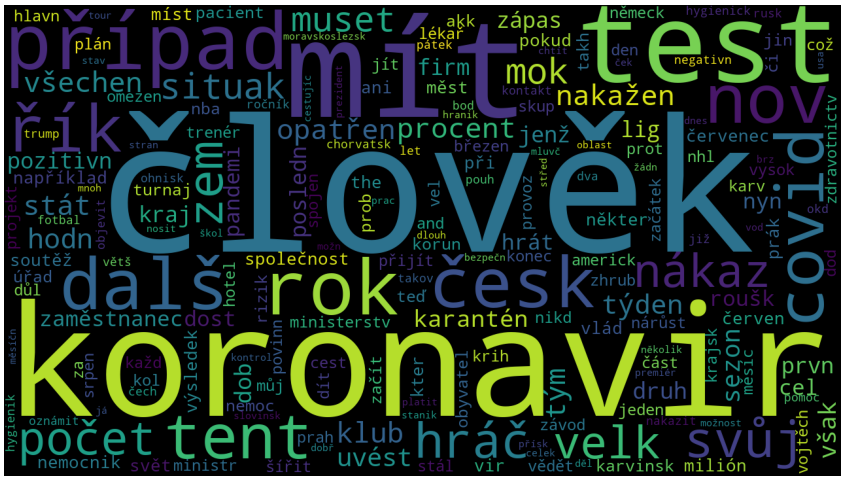
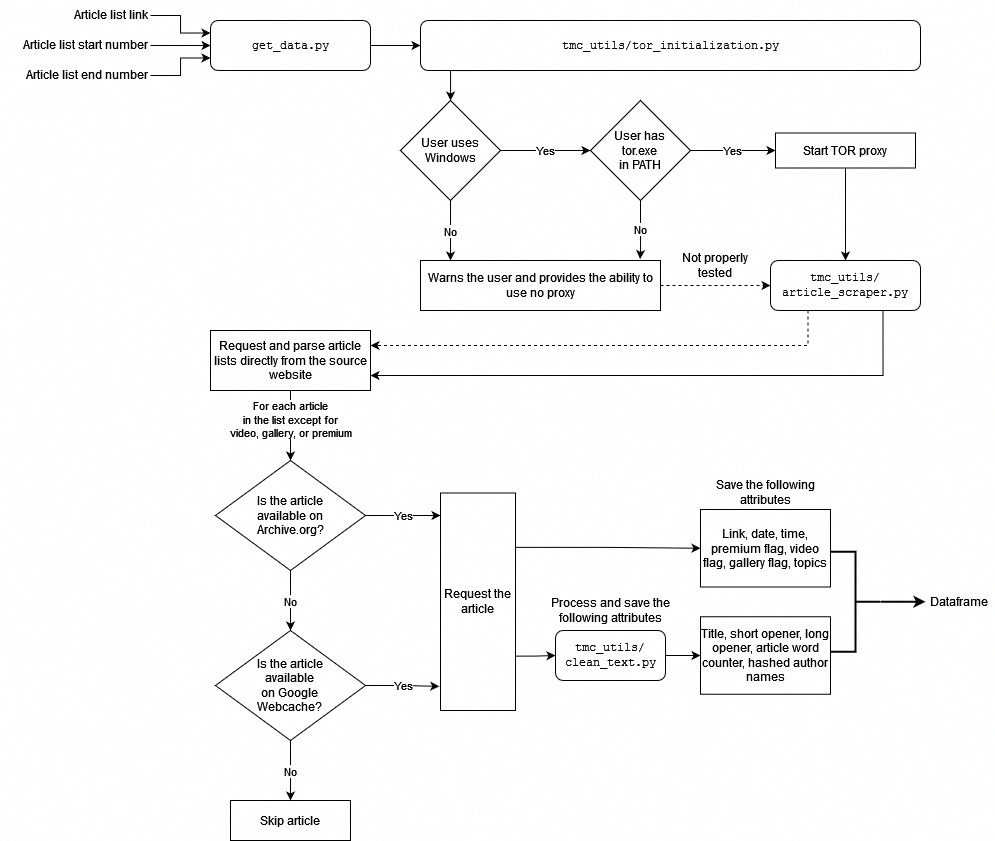

# Final project

**Course:** Data Processing in Python ([JEM207](https://github.com/vitekzkytek/PythonDataIES/))

**Authors:** Martin Řanda & David Černý


This project aims to demonstrate a general framework in visualizing trends in the news. It provides a way to *ethically* scrape a list of link from a particular news website through the [Tor network](https://www.torproject.org/), and requesting individual articles using the [Wayback Machine](https://archive.org/web) or Google Webcache. This is done to minimize the amount of traffic on the original website.

In our case, we visualize a month's worth of coronavirus-related articles from idnes.cz, which can be seen in `data_visualization.ipynb`. It includes both interactive plots generated using [plotly](https://plotly.com/python/) as well as static charts produced by [matplotlib](https://matplotlib.org/). Below is an example of a [Wordcloud](https://github.com/amueller/word_cloud) we generated using the coronavirus data:



We also provide documentation and tutorials in the `docs/` directory of the project in HTML format generated using [MkDocs](https://www.mkdocs.org/). The source Markdown files used for generating the docs can be found in `assets/docs_md`. *Currently*, we don't intend on hosting the documentation using Github Pages, meaning that it is only accessible offline as Github doesn't render HTML files. Alternatively, to see the documentation, run `mkdocs serve` in the root of the directory after installing all the necessary `mkdocs`-related packages:

```
pip install mkdocs mkdocs-material mkdocstrings mkdocstrings-python
```


## Repository structure

```
text-mining-covid/
├─ assets/ # Images and documentation
│  ├─ docs_md/ # Documentation in Markdown
│  │  ├─ ...
│  └─ ...
├─ docs/ # Code documentation in HTML
│  └─...
├─ tmc/ # Folder for Python scripts and data
│  │  ├─ tmc_utils/ # Utility scripts and helper functions
│  │  │  ├─ __init__.py 			# Helper file
│  │  │  ├─ article_scraper.py 		# Script for scraping articles
│  │  │  ├─ clean_text.py 			# Text processing script
│  │  │  └─ tor_initialization.py 	# Route requests through Tor
│  ├─ __init__.py 		# Helper file
│  ├─ data_viz_tools.py # Data visualization snippets
│  ├─ dynamic_join.py 	# CSV file joiner
│  └─ get_data.py 		# Script for obtaining data
├─ .gitignore
├─ README.md
├─ data_visualization.ipynb # Sample analysis
├─ mkdocs.yml
└─ requirements.txt

```


## Process flowchart

Below is a detailed flowchart of how the scripts in this repository interact to generate new data. 



Please, refer to the How-To Guide section in the documentation for more information (in [HTML](./docs/how-to-guide.html) or [Markdown](./assets/docs_md/how-to-guide.md)).


## Requirements

1. Open your shell or command prompt in the root folder of the project
2. Assuming Python 3.10+ is installed, run the following command to install all the packages used in this project

```
pip install -r requirements.txt
```


## Installing Tor

In this project, it is possible (and preferred) to route your requests through Tor on Windows. A convenient way of installing Tor on your <u>Windows</u> personal computer:

1. Install Chocolatey Package Manager https://chocolatey.org/install#individual

2. Open `cmd.exe` with admin privileges

3. Run `choco install tor -y` 


## Sources

We created this project with the help of these sources:

- https://ohyicong.medium.com/how-to-create-tor-proxy-with-python-cheat-sheet-101-3d2d619a1d39
- https://stackoverflow.com/a/33875657
- https://realpython.com/python-nltk-sentiment-analysis/
- https://machinelearninggeek.com/text-analytics-for-beginners-using-python-nltk/
- https://www.kirenz.com/post/2021-12-11-text-mining-and-sentiment-analysis-with-nltk-and-pandas-in-python/text-mining-and-sentiment-analysis-with-nltk-and-pandas-in-python/
