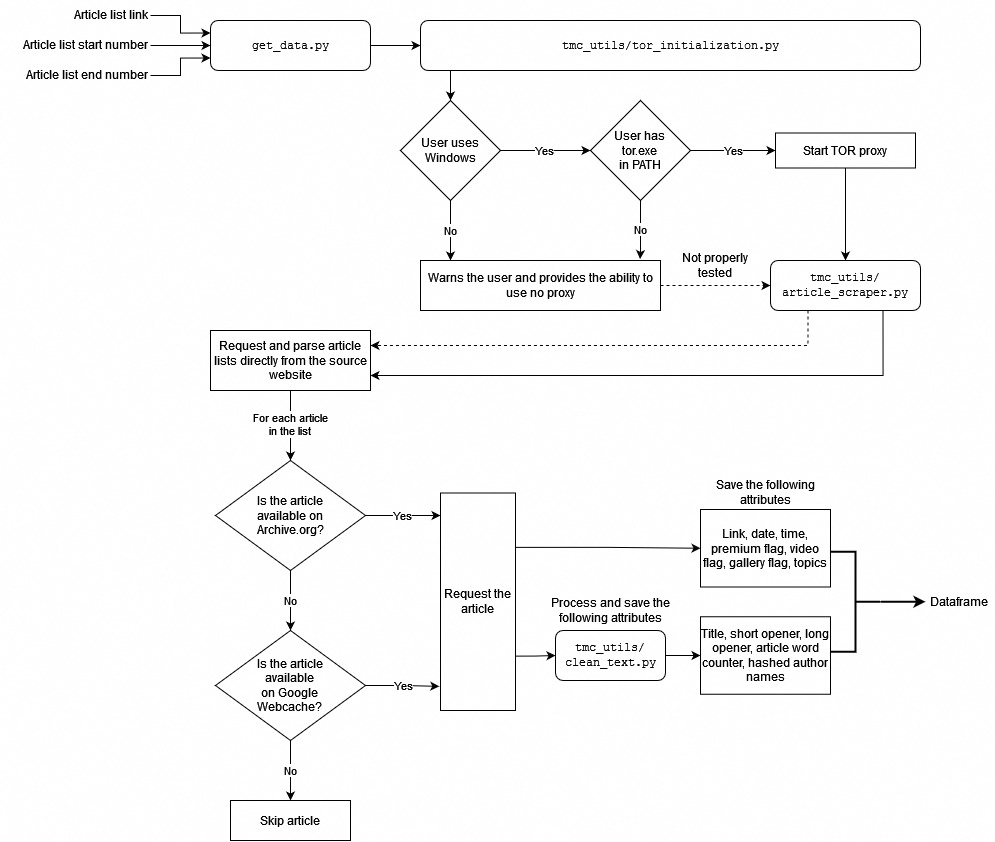

## Requirements

1. Open your shell or command prompt in the root folder of the project
2. Assuming Python 3.10+ is installed, run the following command to install all the packages used in this project

```
pip install -r requirements.txt
```


## Installing TOR

A convenient way of installing TOR on your <u>Windows</u> personal computer:

- Install Chocolatey Package Manager https://chocolatey.org/install#individual

- Open `cmd.exe` with admin privileges
- Run `choco install tor -y` 


## Flowchart




## Documentation

[Testing index](./site/index.html)


## Sources

- https://ohyicong.medium.com/how-to-create-tor-proxy-with-python-cheat-sheet-101-3d2d619a1d39
- https://stackoverflow.com/a/33875657
- https://realpython.com/python-nltk-sentiment-analysis/
- https://machinelearninggeek.com/text-analytics-for-beginners-using-python-nltk/
- https://www.kirenz.com/post/2021-12-11-text-mining-and-sentiment-analysis-with-nltk-and-pandas-in-python/text-mining-and-sentiment-analysis-with-nltk-and-pandas-in-python/
