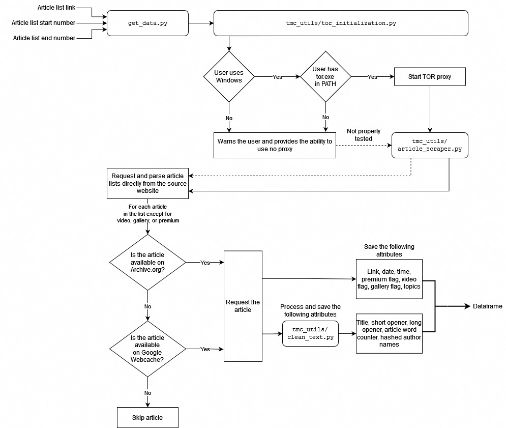

The purpose of this guide is to provide a general overview on how to use some of the code in the repository.

## Adding new data

The `tmc/` folder of this repository contains `get_data.py`, which is used to obtain data regardless of your operating system (properly tested only on Windows). First, the script tries to initiate a Tor session to route requests through Tor. If, for whatever reason, the process fails, requests will not be routed through the network. 

The user is then asked to provide the starting and ending points for the list of articles. Each list contains 36 articles and the minimum start number is 2 while the maximum end number is 455 as of Jan 2023. After the user inputs the start and the end, a summary and a rough approximation of how long the process will take, are printed. For instance, if we input 5 as the start and 7 as the end, the following information is will appear in the console:

```
Input list start (e.g. 289): 5
Input list end (e.g. 290): 7
List start: 5 
List end: 7

    2 lists and around 72 articles will be processed.
    Provided that the user doesn't get rate limited, this
    process might take at least: 18 minutes.
    We recommend processing no more than 2 lists at a time.
    ...
```

The user is then continually informed about the progress—first, a set of *partial dfs* or *partial dataframes* is saved. These contain information from the article lists such as links or *processed* titles. By *processed*, we mostly refer to the text-processing done by the `tmc_utils/clean_text.py` module, which removes punctuation & symbols, removes stopwords, converts text to lowercase, strips off whitespace, tokenizes words, and applies stemming & lemmatization. We explain the use of both stemming and lemmatization in the docstring of this module:

> *Note that people usually choose either stemming or lemmatization in text mining analyses. However, while the lemmatization tool that we use works very well, on its own, it doesn't seem to recognize words such as "koronavirus," which is of paramount importance to our analysis. Thus, we unconventionally apply both techniques.*

After a set of partial dataframes is created, the script then processes each article and appends the text-mined data to the partial dataframes, creating *full dfs* or *full dataframes*. We take precautionary actions to avoid saving any potentially copyright-infringing materials, and thus, the content is heavily processed—the dataset does not include any sentences, only single words, oftentimes with no inflectional changes (e.g., `měsíční --> měsíc`) or in a constrained form (e.g., `vládnoucí --> vlád`). Furthermore, only top 50 words are taken into account from the content of the article, and any other parts that include text (except for article tags / topics) are put in alphabetical order to further dissipate any potential meaning. Overall, our intention is to analyze trends only.

### Process flowchart

Below is a detailed flowchart of how the scripts in this repository interact to generate new data. The inputs are: *article list link*, *start number*, and *end number*. The output is a *full dataframe* as explained above.



Note that the key aspect of this project is to access archived or cached sites in order to minimize the traffic on the original website. We take additional steps in practicing ethical web scraping by, for example, making the time between requests relatively long by default.


## Installing Tor on Windows

In this project, it is possible (and preferred) to route your requests through Tor on Windows. A convenient way of installing Tor on your <u>Windows</u> personal computer:

1. Install Chocolatey Package Manager <https://chocolatey.org/install#individual>

2. Open `cmd.exe` with admin privileges

3. Run `choco install tor -y` 


*Disclaimer: Use of the scripts in this repository for scraping a website without the express written consent of the website owner may be prohibited and might be a violation of the website's terms of service. The user assumes all responsibility for any legal or ethical consequences that may arise from using scripts in this repository.*
